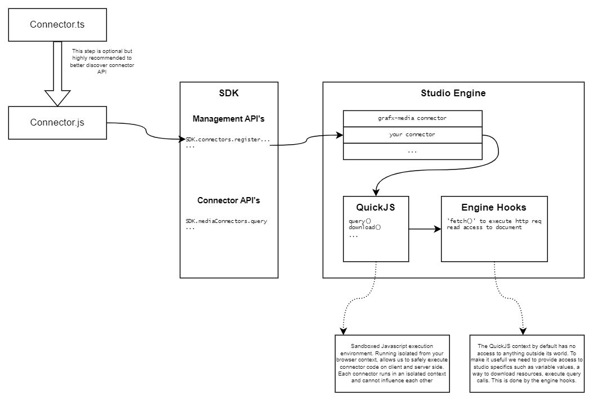

# Getting started

* Open the repo in VS Code 
* Open terminal and run `npm install` (if you haven't, install nodejs)
* Open terminal and run `npm run watch`
* Start editing the src/*.ts connector files
* Watch the build folder compile connector modules! 

# Use in SDK

See [SDK Integration Examples](https://github.com/chili-publish/editor-sdk-integration-examples)

# Studio Connectors

## Introduction

GraFx Studio Connectors is a concept to allow seamless integration to any third party application capable of serving Studio-compliant resources. The traditional and easy to explain example is Media. Today's DAM landscape consists of dozens of solutions, in such a way that providing build-in support for all of them is not feasable, nor maintainable. We needed to engineer a solution that is easy to explain, develop and maintain. 

## General Connector Concept

High level technical goals for the Studio Connectors are:

* Developped in popular and easy scripting language (TS, JS)
* Runs connector logic both in client (browser) and server context
* Secure and isolated from browser
* Ability to enforce memory and CPU limits to ensure UX
* Small footprint and high performance

### Schematic

### Authentication
Authentication and authorization are decoupled from the connector. Inside the connector code you should never store application secrets or anything that allows malicious use of the API you want to connect to. Whatever you need or want to use as authentication method, the information will be dynamically inserted in the runtime by our engine. 
In this first phase we will support a few basic authentication methods:

* HTTP Header
  * For now this is a dynamic way of inserting data into the `fetch` flow. Once the application is loaded (or your connector registered), you can execute the SDK call to set the value for this header. Setting authentication information will trigger the engine to download your media / resources.
* Chili Token
  * This will simply pass the Chili Access Token with the request.

In the meanwhile we are working on more advanced ways to make authenticated calls:
* Proxy
* OAuth

An important note here is that you can choose an authentication method for both client (browser) as server side individually. In a lot of scenario's client side requests do not need extra configuration because the end user is already logged into a platform it tries to access (remember a Studio integration runs on the same domain as the integrating application). The level of security and risk of exposing static keys on server side is obviously very different as well. 
The takeway should be that we hand you all the tools to implement everything 100% secure, but the end responsibility is with the connector author.

### QuickJs

[QuickJS](https://bellard.org/quickjs/) is used internally to execute all user provided scripts. The best comparison is to look at QuickJS as a Virtual Machine in which we can run our Javascript plugins (connector/action/...) while guaranteeing the script can never access anything outside the VM. By restricting the available API's to the connector developers, we can make sure the connector code is fit to run both on client (browser) and server (during ouput generation).

Summary:

Chili-Publish seeks to ensure that connectors **can**:

* Only be run by an explicit user action
* Read any data in your Studio document
* Perform fetch commands to registered domains
* Run both on web and server environments

Chili-Publish seeks to ensure that connectors **can’t**:

* Run by themselves
* Access anything when they aren’t running
* Access data from any template other than the template they were run in
* Change Studio’s UI
* Do any DOM manipulation from within the script

We haven't landed on the specifics, but we made sure all third party code running in the Studio application will be capped both by execution time (CPU) and memory. Code violating the contraints, will be disabled during the session.

## Connector.js 

This repo contains examples of Typescript connectors which can be transpiled to a Javascript module. While the API surface is not stable yet, and we preserve the right to make changes before going into long term support, it was tested internally and considered the minimal API's needed to allow a full featured Media browser and things like Dynamic Asset Provider. Beware that some things are still in active development, for example we plan to support the ES2020 import / export syntax, but currently using it will fail to register the connector. 
We need your feedback! If you think you are missing critical stuff to implement your connector, let us know! By all means, open a ticket on the SDK repo.

## Connector.json

This is the wrapper adding metadata to the connector script. For now, and this is subject to change, it is needed to embed the script as a json string inside the .json file. In the SDK, we need to provide a URL to this file to finally load the connector. The URL is required to be accessible on the public internet (because we want to use it during output generation).

# Early Access Program

This repository is part of the CHILI publish Early Access program in preparation of SpicyTalks. If you want to know more, reach out to your main CHILI contact.

# SDK Documentation

[Link to the official SDK documentation on GitHub](https://chili-publish.github.io/studio-sdk/)

# Feedback?

If you have any feedback on the technical parts of the application, a feature request, a bug to report or a general technical question, don’t hesitate to [create a new issue in the SDK repository](https://github.com/chili-publish/editor-sdk/issues/new/choose).

# License

This project is [MIT licensed](https://github.com/chili-publish/grafx-connector-template/blob/main/LICENSE).
